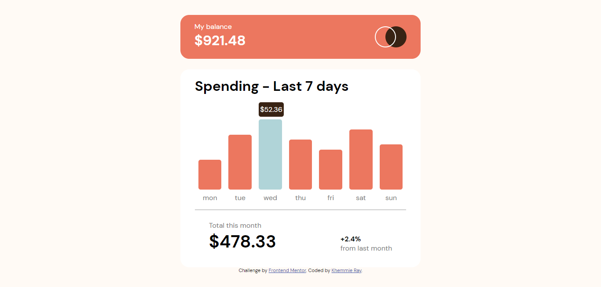

# Frontend Mentor - Expenses chart component solution

This is a solution to the [Expenses chart component challenge on Frontend Mentor](https://www.frontendmentor.io/challenges/expenses-chart-component-e7yJBUdjwt). Frontend Mentor challenges help you improve your coding skills by building realistic projects. 

### Table of contents

- [Overview](#overview)
  - [The challenge](#the-challenge)
  - [Screenshot](#screenshot)
  - [Links](#links)
- [My process](#my-process)
  - [Built with](#built-with)
  - [What I learned](#what-i-learned)
  - [Continued development](#continued-development)
- [Author](#author)

#### Overview

### The challenge

Users should be able to:

- View the bar chart and hover over the individual bars to see the correct amounts for each day
- See the current day’s bar highlighted in a different colour to the other bars
- View the optimal layout for the content depending on their device’s screen size
- See hover states for all interactive elements on the page

### Screenshot

### Links

- Solution URL: [https://github.com/Khemmie-Ray/Expenses-chart.git](https://github.com/Khemmie-Ray/Expenses-chart.git)
- Live Site URL: [https://khemmie-ray.github.io/Expenses-chart/Add live site URL here](https://khemmie-ray.github.io/Expenses-chart/)

## My process

### Built with

- Semantic HTML5 markup
- Flex

### What I learned

I learnt how to create bar charts using HTML5 and CSS flex property.

### Continued development

I would like to focus on a more dynamic banner as specified by the designs.

## Author

- Frontend Mentor - [@Khemmie-Ray](https://www.frontendmentor.io/profile/khemmie-ray)
- Twitter - [@haramide](https://www.twitter.com/haramide)

#